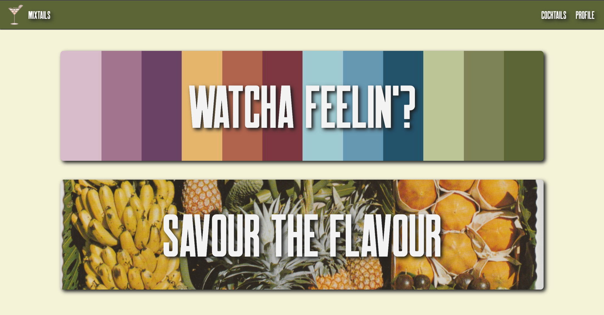
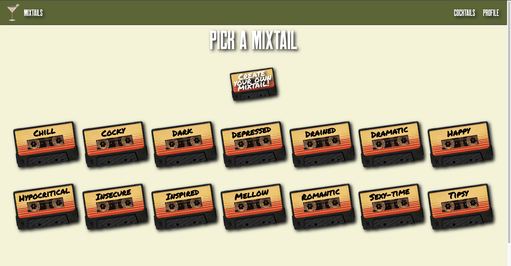
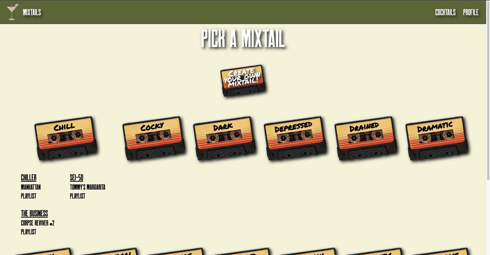
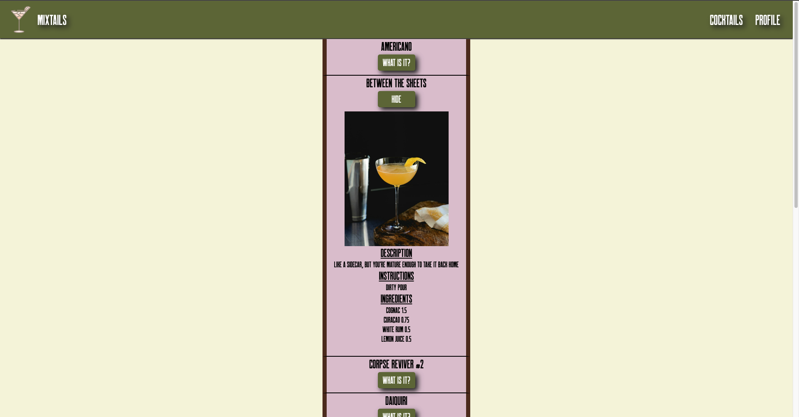
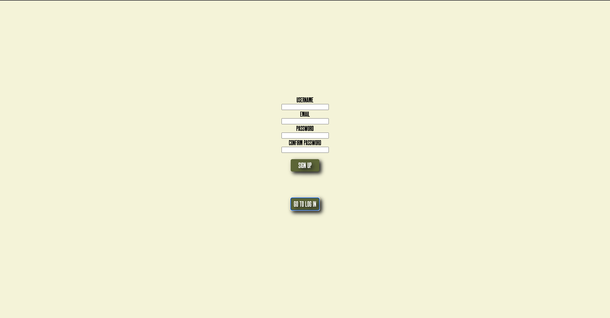

# Mixtails

## The App

You ever feel like you can't choose what to drink? Mixtails' got your back. It combines music, cocktails, and mood. It was built using the MERN-stack.

## Team Fetch 75
* Alexandre Lord [github](https://github.com/alexandrelord)
* Jamie Pantling [github](https://github.com/jamiepantling)
* Benny Yang [github](https://github.com/Rightanglewrong)

## Images
#### Main Page

#### Moods Page

 

#### Cocktails Page

 

#### Sign Up Form

## Technologies
* React
* Express
* Node.js
* Mongodb 
* HTML/CSS 

## Freezer Features
* Improve responsiveness of website
* * Hitting the Spotify API
* Create a Cocktail Show Page for users to share cocktail recipes
* Implement Weather API and sort drinks by weather based on your location
